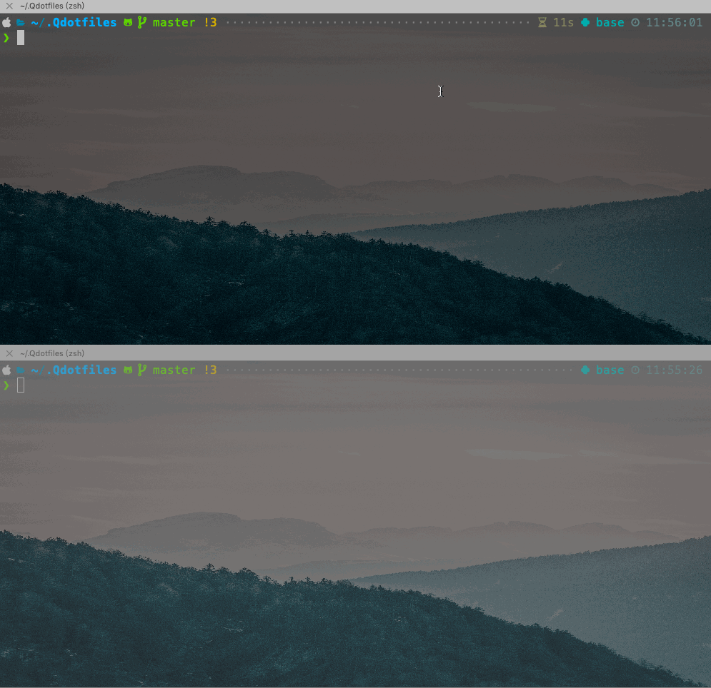

# Dotfiles of QiangZiBro

My personal configurations in linux/mac, use at your own risk!


## How to use

**Run as quick as possible:**

```bash
# A start of configuration in a new machine (will clone the project in `~/.Qdotfiles`)
bash -c "$(curl -fsSL https://raw.githubusercontent.com/QiangZiBro/Qdotfiles/master/scripts/bootstrap.sh)"
```

**Backup dotfiles:**

```bash
~/.Qdotfiles/scripts/backup
```

**Use in docker**

```bash
# 1.clone
git clone https://github.com/QiangZiBro/Qdotfiles ~/.Qdotfiles && cd ~/.Qdotfiles
# 2.put ss.json (a shadowsocks configuration) in `ss/` directory

# 3.build the image
docker-compose build --build-arg INSTALL_SOFTWARES=true
```


**Use ss service  with docker container**




